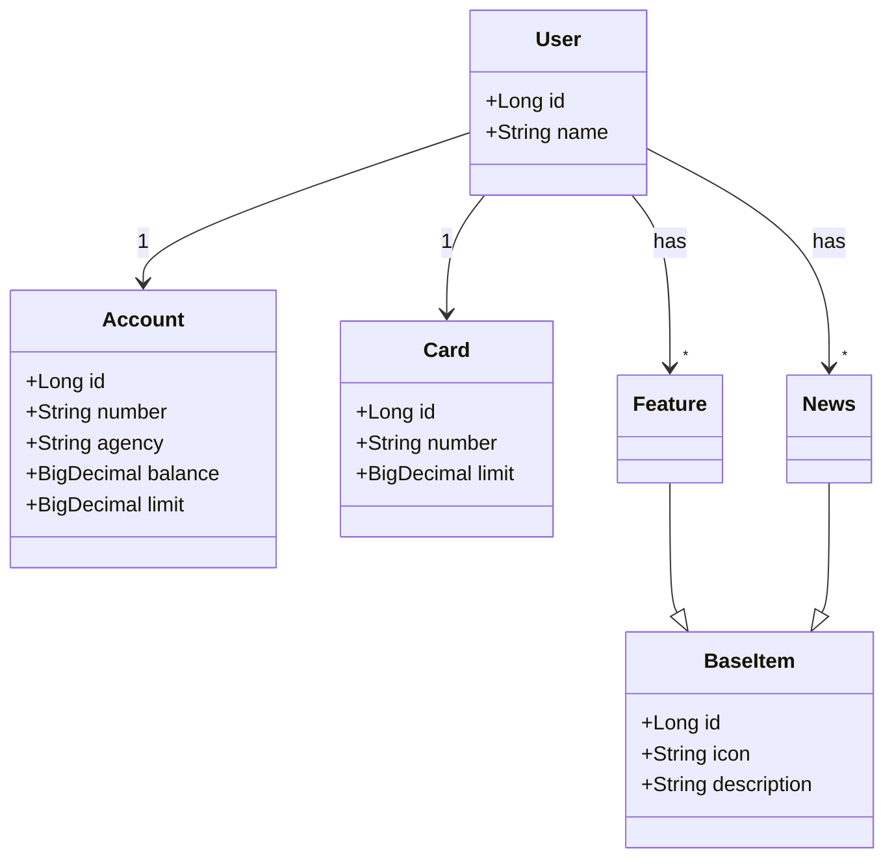

# Java RESTful API 

```mermaid
classDiagram
    class Account {
        +Long id
        +String number
        +String agency
        +BigDecimal balance
        +BigDecimal limit
    }
    
    class Card {
        +Long id
        +String number
        +BigDecimal limit
    }
    
    class BaseItem {
        +Long id
        +String icon
        +String description
    }
    
    class Feature {
    }
    Feature --|> BaseItem
    
    class News {
    }
    News --|> BaseItem
    
    class User {
        +Long id
        +String name
    }
    User --> Account : 1
    User --> Card : 1
    User --> "*" Feature : has
    User --> "*" News : has

```
